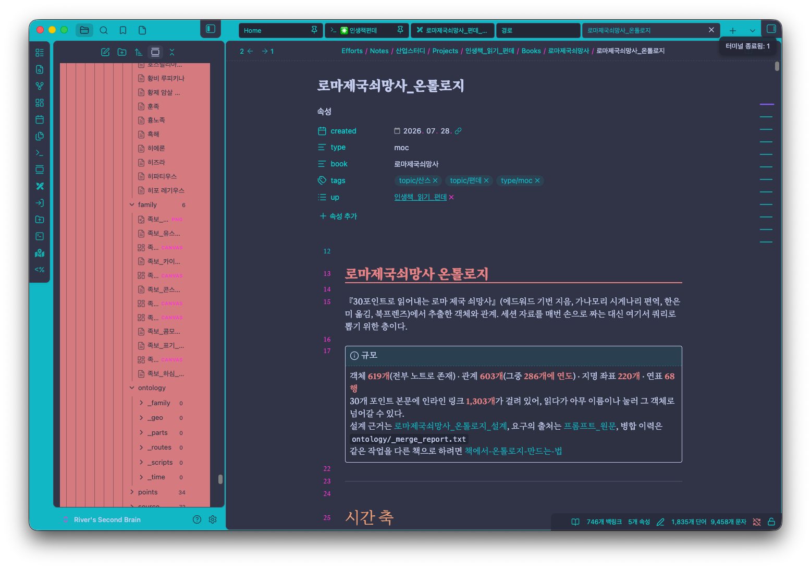
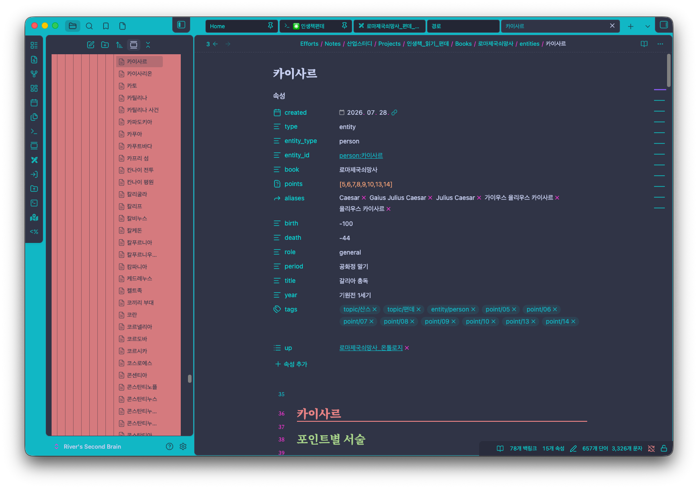
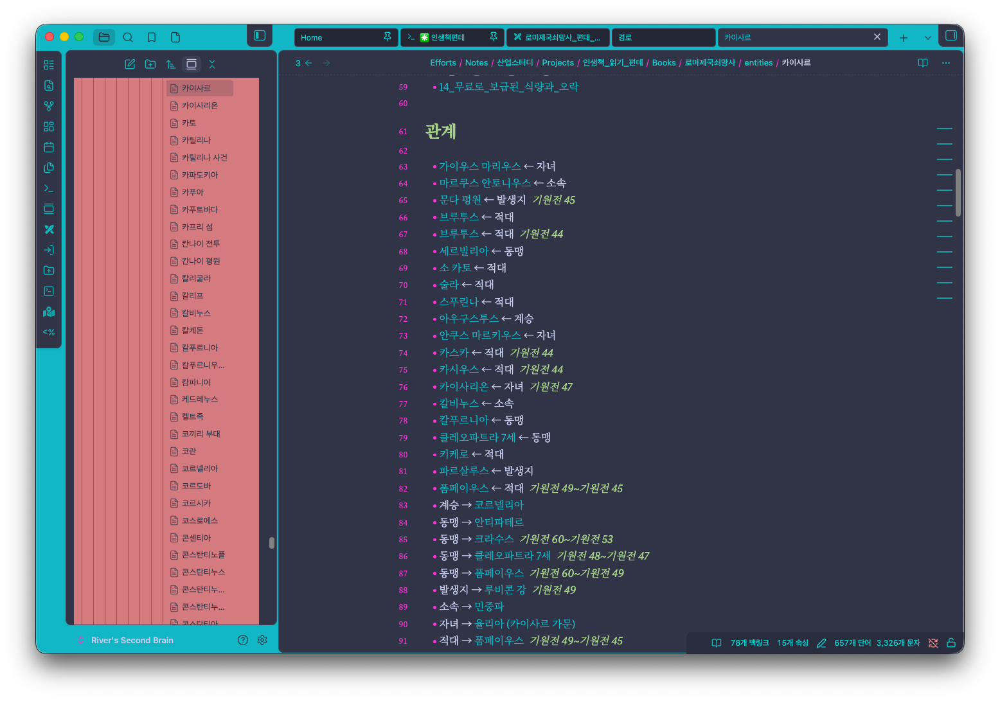
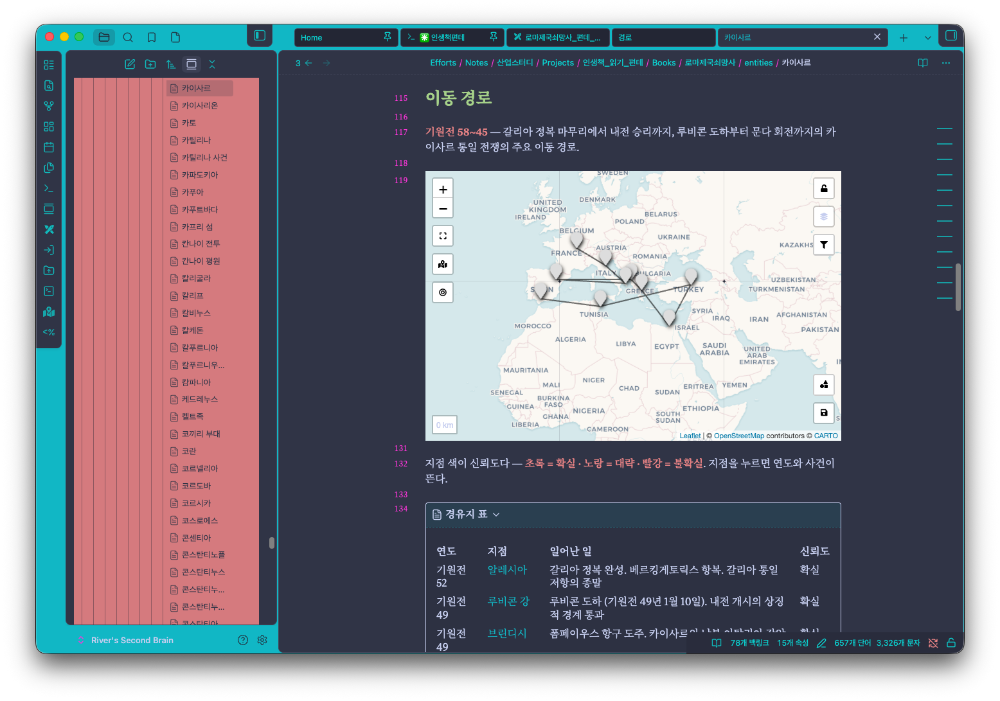
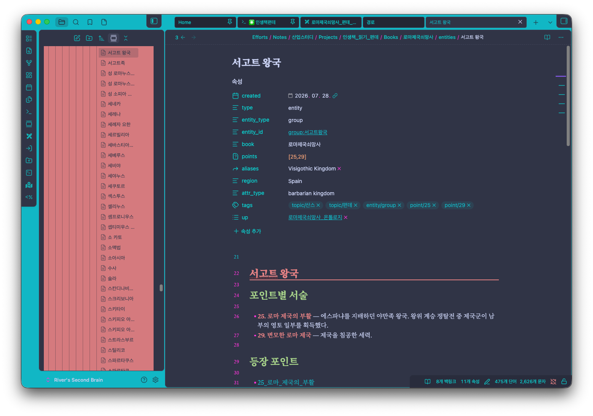
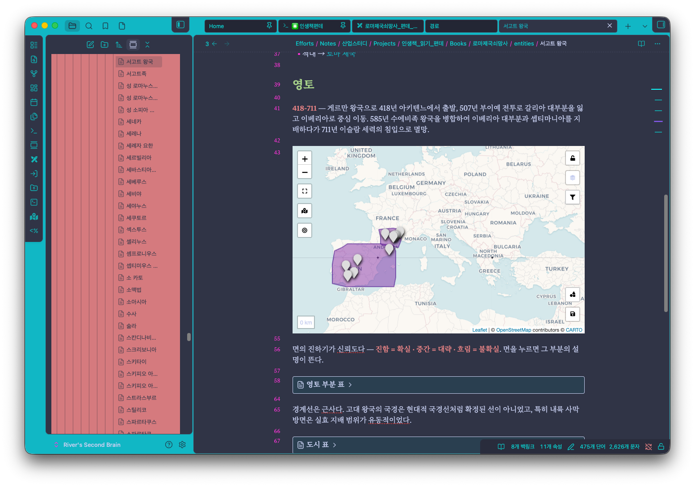

# 로마제국쇠망사 자료 폴더

에드워드 기번(Edward Gibbon)의 『로마제국쇠망사』(The History of the Decline and Fall of the Roman Empire, 1776년 초판) — 사기(史記) 완독 후 인생책 편데 하반기 신규 텍스트.

대표님 예고 ([[35_산업스터디_260712]], 2026-07-12): "에드워드 기번 원전이든 AI 요약이든 자유롭게 공부하라." 단, **시오노 나나미의 『로마인 이야기』는 절대 읽지 말 것** — 소설적 요소가 많아 역사서로 부적합. 역사는 사료에 근거한 정론으로 공부해야 한다는 원칙. 목표 기간 6개월, 완료 후 오디세이아·일리아드로 이어질 계획.

## 원전 링크

- [Google Books 미리보기](https://books.google.so/books?id=0lUTBgAAQBAJ&printsec=frontcover#v=onepage&q&f=false)
- [Project Gutenberg #25717 — 전자책 정보](https://www.gutenberg.org/ebooks/25717)
- [Project Gutenberg #25717 — 본문 (HTML)](https://www.gutenberg.org/cache/epub/25717/pg25717-images.html)
- [Project Gutenberg 홈](https://www.gutenberg.org/) — 퍼블릭 도메인 원서 검색 사이트, 이 책 저본 출처

## 폴더 구성

| 폴더 | 내용 |
|------|------|
| `chapters/` | 챕터 한·영 대조 번역 (Gutenberg #25717 저본, 번역/원문 토글 HTML) |
| `visual/` | 챕터별 해설 자료 |
| `source/` | Gibbon 영문 원전 71장 전문 (Gutenberg #25717 분할) |
| `points/` | 『30포인트로 읽어내는 로마 제국 쇠망사』 본문. 30개 포인트 + 일러두기·책머리에·옮기고 나서 + 목차([[00_목차]]) |
| `ontology/` | 객체·관계·연표 데이터셋 |
| `entities/` | 핵심 객체 노트 (2개 이상 포인트 등장) |

진입점은 둘이다. 책을 읽으려면 [[00_목차]], 데이터를 쓰려면 [[로마제국쇠망사_온톨로지]]. 설계 근거는 [[로마제국쇠망사_온톨로지_설계]], 이 작업이 어떤 요구에서 나왔는지는 [[프롬프트_원문]]에 있다.

원전은 두 계통이다. `chapters/`·`source/`는 기번 영문 원전 계통이고, `points/`·`ontology/`·`entities/`는 가나모리 시게나리 편역 30포인트 한국어판 계통이다. 진입점은 [[로마제국쇠망사_온톨로지]].

## Obsidian에서 보기

이 폴더는 Obsidian Flavored Markdown으로 쓰였다 — 위키링크(`[[문서명]]`)·frontmatter·Dataview 쿼리·Leaflet 지도 블록이 섞여 있다. GitHub 웹 화면이나 일반 텍스트 편집기에서는 이 문법이 렌더링되지 않고 그대로 글자로 보인다. 원래 모습대로 보려면 Obsidian 앱이 필요하다.

이미 산업스터디 볼트를 쓰고 있다면 이 레포는 그 볼트 안 `Books/로마제국쇠망사/`의 미러이므로 볼트에서 그대로 열면 된다. 새로 클론한 경우엔 이 폴더를 Obsidian에서 "폴더를 볼트로 열기"로 열면 된다.

지도·표까지 보려면 커뮤니티 플러그인이 필요하다.

- **Leaflet** — `entities/` 안 장소 노트 290여 개가 `location:` 좌표로 미니 지도를 그린다. 없으면 ` ```leaflet ` 코드블록이 그대로 텍스트로 보인다.
- **Dataview** — [[로마제국쇠망사_온톨로지]]의 인물·지명·사건·30포인트 목록이 이걸로 자동 생성된다.
- 족보(`family/*.canvas`)는 Obsidian 코어 Canvas 기능이라 플러그인 없이도 열린다.

`entities/*.md`의 `mapmarker:` 값(city·region·river·sea·building·island·battlefield·mountain·lake·cape, 10종)이 Leaflet 플러그인의 마커 등록표에 없으면 회색 기본 마커로 대체되며 경고가 뜬다 — 지도 기능 자체엔 지장 없다. 신경 쓰인다면 플러그인 설정 > Leaflet > Marker Icons에서 위 10종을 등록하면 된다.

## 미리보기 스크린샷

GitHub 웹 화면에서는 위키링크·Dataview 쿼리·Leaflet 지도가 코드블록 텍스트로만 보인다. 실제 Obsidian에서 열었을 때 모습을 스크린샷으로 남긴다. 이해를 돕는 사진은 계속 추가될 예정이다.


`로마제국쇠망사_온톨로지.md` 진입 화면. Properties 패널과 "규모" 요약, 설계 근거·병합 이력 링크가 보인다.


`entities/카이사르.md`. entity_type·points·aliases·생몰년 등 인물 엔티티 프론트매터 스키마 예시.


같은 노트의 "관계" 섹션. 위키링크로 연결된 다른 엔티티와의 관계가 화살표+연도로 나열된다.


"이동 경로" 섹션. Leaflet 지도에 갈리아 정복~내전 승리(기원전 58~45년) 경로가 점·선으로, 신뢰도가 색으로 표시된다.


`entities/서고트 왕국.md`. entity_type: group — 인물과 필드 구성이 다른 집단 타입 프론트매터 예시.


"영토" 섹션. 418~711년 영토가 폴리곤으로, 신뢰도가 음영 진하기로 표시된다.

## AI 에이전트가 이 레포를 다룰 때

- **진입점 둘** — 책을 읽으려면 [[00_목차]](`points/`), 데이터를 다루려면 [[로마제국쇠망사_온톨로지]](루트). 설계 근거는 [[로마제국쇠망사_온톨로지_설계]].
- **`entities/` 프론트매터 스키마** — `entity_type`(person/place/event/group/institution/work), `entity_id`, `location`([위도, 경도], place만), `mapmarker`, `points`(등장 포인트 번호 배열), `aliases`, `up: [[로마제국쇠망사_온톨로지]]`.
- **원전 두 계통을 섞지 말 것** — `chapters/`·`source/`는 기번 영문 원전 계통, `points/`·`_raw/`·`ontology/`·`entities/`는 30포인트 한국어판 계통이다. 인물·사건 서술을 인용·요약할 때 두 계통을 혼동하면 사실관계가 어긋난다.
- **`_raw/`·`points/`는 시판 중인 도서(북프렌즈 『30포인트로 읽어내는 로마 제국 쇠망사』)의 OCR 원문·재서술이다** — 이 레포가 private인 이유. 외부 공개·재배포 목적으로 가공하거나 이 두 폴더를 public 레포·서비스로 옮기지 말 것.
- **`ontology/_scripts/`**에 엔티티·관계 데이터를 재생성하는 파이썬 스크립트가 있다. `entities/*.md`를 대량으로 손으로 고치기 전에 스크립트로 재생성하는 쪽이 나은지 먼저 확인한다.
- **위키링크 해석** — `[[문서명]]`은 확장자 없는 파일명(또는 frontmatter `aliases`)과 매칭된다. GitHub이나 일반 마크다운 도구로 읽을 땐 이 링크가 렌더링되지 않으므로, 참조 대상을 찾으려면 `entities/`·`points/` 안에서 같은 이름의 `.md` 파일을 직접 찾으면 된다.
- **정합성 규칙** — 연대·인물 생몰년 등 핵심 수치는 파일마다 다르면 안 된다. 다르면 어느 쪽이 채택값인지 명시하고 통일한다.

## 목차 진행상황

| 장 | 제목 | 번역 | 해설 |
|---|---|---|---|
| 1장 | 안토니누스 시대 제국의 판도 | ✅ | ✅ |
| 2장 | 안토니누스 시대의 내부적 번영 (제1부) | ✅ | ✅ |
