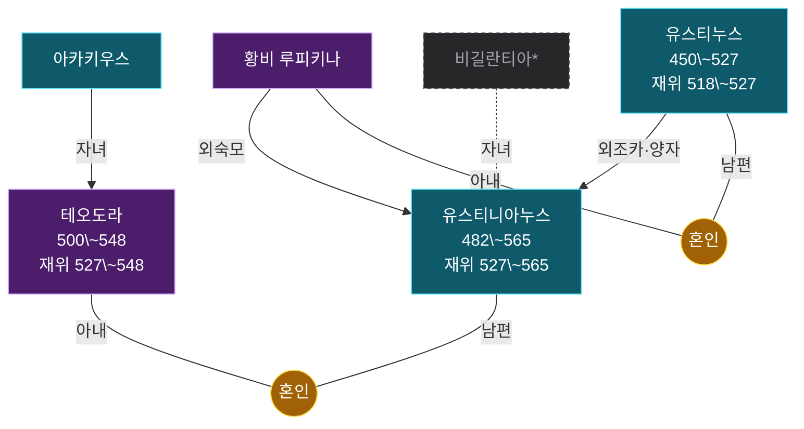

# 족보 유스티니아누스 계열

인물 6명. 온톨로지의 혈연·혼인·계승 관계에서 생성했다 — 손으로 그린 그림이 아니라 데이터의 파생물이라, 관계를 고치고 `rome30_family.py`를 다시 돌리면 이 그림도 따라 바뀐다.

노란 동그라미가 혼인이고, 자녀는 거기서 내려온다. 상자는 그 혼인에서 난 형제다. 모든 선에 관계를 적었다 — 남편·아내·자녀, 그리고 양자·조부처럼 혈연이 아닌 계보. **점선과 흐린 칸은 이 책 본문에 없는 맥락 보강**이다. 조부·숙부가 빠지면 계보가 끊겨 보여서 외부 지식으로 보탰고, 이름 뒤 별표는 볼트에 노트가 없는 인물이다. 굵은 선은 제위 계승으로 혈연과 다른 축이다. 붉은 칸은 재위 기록이 있는 인물이다.

더 정밀한 그림은 같은 이름의 `.canvas` 파일에 있다 — 세대 번호·개인 번호·남녀 배치까지 계보도 표기를 따랐다. 표기 규칙은 [[족보_표기_설계]]에 있다.

> [!note]- 가까운 친족
>
> 그림에서 선을 따라 세면 나오는 것을 표로 옮겼다. 혈연 간선만 타므로 양자·조부처럼 대를 건너뛴 계보는 여기 들어가지 않는다. 호칭은 보는 사람의 성별과 상대의 나이에 따라 달라진다 — 같은 사람이 누구에게는 백부, 누구에게는 숙부다.
>
> | 사람 | 관계 |
> |---|---|
> | [[유스티니아누스]] | **어머니** 비길란티아\* · **배우자** [[테오도라]] |
> | [[테오도라]] | **아버지** [[아카키우스]] · **배우자** [[유스티니아누스]] |
> | 비길란티아\* | **아들** [[유스티니아누스]] |
> | [[아카키우스]] | **딸** [[테오도라]] |
> | [[유스티누스]] | **배우자** [[황비 루피키나]] |
> | [[황비 루피키나]] | **배우자** [[유스티누스]] |

### 인물

- [[유스티니아누스]] — 농민 출신 백부 유스티누스의 조카로, 동로마 제국의 황제가 되어 38년 이상 통치했으며 제국의 영토를 회복하고 로마법 대전을 완성한 최후의 로마 황제.
- [[테오도라]] — 경기장 동물 사육사의 차녀로 태어나 창녀에서 황비가 된 여성. 유스티니아누스의 신뢰를 받아 국정에 깊은 영향을 미쳤으며 자선사업을 통해 여성들을 돕고자 했다.
- [[아카키우스]] — 콘스탄티노플 대경기장의 동물 사육사. 테오도라의 아버지로 주변 사람들로부터 '곰의 남편'이라 불릴 만큼 친근감이 있었던 인물.
- [[유스티누스]] — 농민 출신으로 직업 군인의 길을 걸어 68세에 황제가 된 유스티니아누스의 백부. 정치에 무능했지만 뛰어난 재무관 덕분에 장기간 통치했다.
- [[황비 루피키나]] — 유스티니아누스의 백모이자 당시 황비. 테오도라와의 결혼을 노골적으로 반대했다.
- 비길란티아\* — 유스티누스의 누이이자 유스티니아누스의 어머니 (본문 밖 보강)
