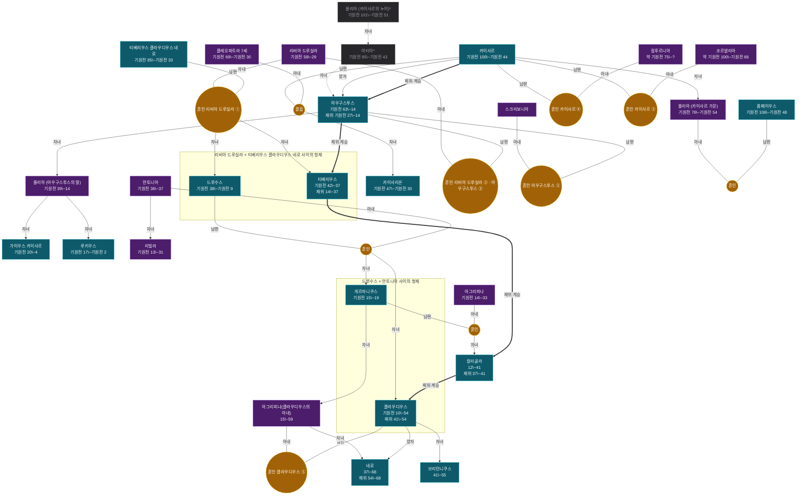

# 족보 카이사르 계열

인물 27명. 온톨로지의 혈연·혼인·계승 관계에서 생성했다 — 손으로 그린 그림이 아니라 데이터의 파생물이라, 관계를 고치고 `rome30_family.py`를 다시 돌리면 이 그림도 따라 바뀐다.

노란 동그라미가 혼인이고, 자녀는 거기서 내려온다. 상자는 그 혼인에서 난 형제다. 모든 선에 관계를 적었다 — 남편·아내·자녀, 그리고 양자·조부처럼 혈연이 아닌 계보. **점선과 흐린 칸은 이 책 본문에 없는 맥락 보강**이다. 조부·숙부가 빠지면 계보가 끊겨 보여서 외부 지식으로 보탰고, 이름 뒤 별표는 볼트에 노트가 없는 인물이다. 굵은 선은 제위 계승으로 혈연과 다른 축이다. 붉은 칸은 재위 기록이 있는 인물이다.

더 정밀한 그림은 같은 이름의 `.canvas` 파일에 있다 — 세대 번호·개인 번호·남녀 배치까지 계보도 표기를 따랐다. 표기 규칙은 [[족보_표기_설계]]에 있다.

> [!note]- 가까운 친족
>
> 그림에서 선을 따라 세면 나오는 것을 표로 옮겼다. 혈연 간선만 타므로 양자·조부처럼 대를 건너뛴 계보는 여기 들어가지 않는다. 호칭은 보는 사람의 성별과 상대의 나이에 따라 달라진다 — 같은 사람이 누구에게는 백부, 누구에게는 숙부다.
>
> | 사람 | 관계 |
> |---|---|
> | [[게르마니쿠스]] | **아버지** [[드루수스]] · **조모** [[리비아 드루실라]] · **조부** [[티베리우스 클라우디우스 네로]] · **어머니** [[안토니아]] · **백부** [[티베리우스]] · **여동생** [[리빌라]] · **남동생** [[클라우디우스]] · **아들** [[칼리굴라]] · **딸** [[아그리피나(클라우디우스의 아내)]] · **외손자** [[네로]] |
> | [[아그리피나(클라우디우스의 아내)]] | **아버지** [[게르마니쿠스]] · **조부** [[드루수스]] · **증조모** [[리비아 드루실라]] · **증조부** [[티베리우스 클라우디우스 네로]] · **조모** [[안토니아]] · **고모** [[리빌라]] · **숙부** [[클라우디우스]] · **오빠** [[칼리굴라]] · **아들** [[네로]] · **배우자** [[클라우디우스]] |
> | [[칼리굴라]] | **아버지** [[게르마니쿠스]] · **조부** [[드루수스]] · **증조모** [[리비아 드루실라]] · **증조부** [[티베리우스 클라우디우스 네로]] · **조모** [[안토니아]] · **어머니** [[아그리피나]] · **고모** [[리빌라]] · **숙부** [[클라우디우스]] · **여동생** [[아그리피나(클라우디우스의 아내)]] |
> | [[클라우디우스]] | **아버지** [[드루수스]] · **조모** [[리비아 드루실라]] · **조부** [[티베리우스 클라우디우스 네로]] · **어머니** [[안토니아]] · **백부** [[티베리우스]] · **형** [[게르마니쿠스]] · **누나** [[리빌라]] · **아들** [[브리탄니쿠스]] · **배우자** [[아그리피나(클라우디우스의 아내)]] |
> | [[브리탄니쿠스]] | **아버지** [[클라우디우스]] · **조부** [[드루수스]] · **증조모** [[리비아 드루실라]] · **증조부** [[티베리우스 클라우디우스 네로]] · **조모** [[안토니아]] · **백부** [[게르마니쿠스]] · **고모** [[리빌라]] |
> | [[드루수스]] | **어머니** [[리비아 드루실라]] · **아버지** [[티베리우스 클라우디우스 네로]] · **형** [[티베리우스]] · **아들** [[게르마니쿠스]], [[클라우디우스]] · **손녀** [[아그리피나(클라우디우스의 아내)]] · **손자** [[칼리굴라]], [[브리탄니쿠스]] |
> | [[네로]] | **어머니** [[아그리피나(클라우디우스의 아내)]] · **외조부** [[게르마니쿠스]] · **증외조부** [[드루수스]] · **증외조모** [[안토니아]] · **외삼촌** [[칼리굴라]] |
> | [[아우구스투스]] | **어머니** 아티아\* · **외조모** 율리아 (카이사르의 누이)\* · **딸** [[율리아 (아우구스투스의 딸)]] · **외손자** [[가이우스 카이사르]], [[루키우스]] · **배우자** [[리비아 드루실라]], [[스크리보니아]] |
> | [[가이우스 카이사르]] | **어머니** [[율리아 (아우구스투스의 딸)]] · **외조부** [[아우구스투스]] · **증외조모** 아티아\* · **남동생** [[루키우스]] |
> | [[루키우스]] | **어머니** [[율리아 (아우구스투스의 딸)]] · **외조부** [[아우구스투스]] · **증외조모** 아티아\* · **형** [[가이우스 카이사르]] |
> | [[안토니아]] | **아들** [[게르마니쿠스]], [[클라우디우스]] · **손녀** [[아그리피나(클라우디우스의 아내)]] · **손자** [[칼리굴라]], [[브리탄니쿠스]] · **딸** [[리빌라]] |
> | [[율리아 (아우구스투스의 딸)]] | **아버지** [[아우구스투스]] · **조모** 아티아\* · **증조모** 율리아 (카이사르의 누이)\* · **아들** [[가이우스 카이사르]], [[루키우스]] |
> | [[리비아 드루실라]] | **아들** [[티베리우스]], [[드루수스]] · **손자** [[게르마니쿠스]], [[클라우디우스]] · **배우자** [[아우구스투스]], [[티베리우스 클라우디우스 네로]] |
> | [[리빌라]] | **어머니** [[안토니아]] · **오빠** [[게르마니쿠스]] · **남동생** [[클라우디우스]] |
> | 아티아\* | **어머니** 율리아 (카이사르의 누이)\* · **아들** [[아우구스투스]] · **손녀** [[율리아 (아우구스투스의 딸)]] |
> | [[율리아 (카이사르 가문)]] | **아버지** [[카이사르]] · **남동생** [[카이사리온]] · **배우자** [[폼페이우스]] |
> | [[카이사르]] | **딸** [[율리아 (카이사르 가문)]] · **아들** [[카이사리온]] · **배우자** [[칼푸르니아]], [[코르넬리아]] |
> | [[카이사리온]] | **아버지** [[카이사르]] · **어머니** [[클레오파트라 7세]] · **누나** [[율리아 (카이사르 가문)]] |
> | [[티베리우스]] | **어머니** [[리비아 드루실라]] · **아버지** [[티베리우스 클라우디우스 네로]] · **남동생** [[드루수스]] |
> | [[티베리우스 클라우디우스 네로]] | **아들** [[티베리우스]], [[드루수스]] · **손자** [[게르마니쿠스]], [[클라우디우스]] · **배우자** [[리비아 드루실라]] |
> | 율리아 (카이사르의 누이)\* | **딸** 아티아\* · **외손자** [[아우구스투스]] |
> | [[스크리보니아]] | **배우자** [[아우구스투스]] |
> | [[아그리피나]] | **아들** [[칼리굴라]] |
> | [[칼푸르니아]] | **배우자** [[카이사르]] |
> | [[코르넬리아]] | **배우자** [[카이사르]] |
> | [[클레오파트라 7세]] | **아들** [[카이사리온]] |
> | [[폼페이우스]] | **배우자** [[율리아 (카이사르 가문)]] |

### 인물

- [[카이사르]] — 스물일곱 살에 원로원으로부터 추방당했으나 군중의 지지로 복권되었다. 천재지만 두통과 간질을 앓았고, 여성들에게 인기가 많았으며 동성애자이기도 했던 것으로 추측된다
- [[아우구스투스]] — 카이사르 사후 공화제를 개혁하여 초대 황제가 된 인물. 디오클레티아누스와 같이 새로운 제국의 창건자로 평가된다.
- [[네로]] — 제5대 황제. 초기에는 세네카의 섭정 아래 선정을 베풀었으나 점차 폭군이 되어 마침내 자살로 생을 마감했다.
- [[폼페이우스]] — 술라를 지지하는 귀족군에 가담했으며, 후에 스파르타쿠스 반란을 진압하고 로마의 실력자가 되었다. 나중에 카이사르와 삼두정치를 이루었다.
- [[칼리굴라]] — 제3대 황제. 유대 민족에게 예루살렘 신전에 자신의 신상을 세우도록 명령하여 강한 신격화를 주장했다.
- [[클라우디우스]] — 뛰어난 역사가이기도 한 황제. 푸키누스 호수에서 대규모 모의 해전을 개최한 인물.
- [[클레오파트라 7세]] — 이집트 프톨레마이오스 왕조의 여왕. 카이사르와 융단에 숨어 만나 그의 마음을 사로잡았으며 아들 카이사리온을 낳았다.
- [[티베리우스]] — 제2대 황제. 불운을 타고났으나 공정하고 적확한 치세로 로마의 국력을 배가시켰다.
- [[드루수스]] — 아우구스투스의 아들. 스무 살에 장군이 되었으나 전투 중 낙마로 사망했다.
- [[아그리피나]] — 게르마니쿠스의 미망인. 아우구스투스의 손녀. 제5대 황제 네로의 할머니. 권력욕이 강했다.
- [[율리아 (아우구스투스의 딸)]] — 아우구스투스의 딸. 성격이 활달하고 색정이 넘쳤으며 여러 번의 결혼을 강요받았다.
- [[리비아 드루실라]] — 티베리우스의 어머니. 아우구스투스의 아내였으며 황태후로서 '조국의 어머니'로 불렸다.
- [[브리탄니쿠스]] — 클라우디우스의 아들. 아그리피나에 의해 제위 계승권을 박탈당했다.
- [[율리아 (카이사르 가문)]] — 카이사르의 딸로 폼페이우스와 정략결혼했으나 죽자 폼페이우스가 카이사르와 인연을 끊는 계기가 되었다.
- [[카이사리온]] — 카이사르와 클레오파트라 사이에서 태어난 아들. 9개월간의 결혼 생활로부터 태어났다.
- [[칼푸르니아]] — 카이사르의 아내. 남편의 죽음에 대한 악몽을 꾸었다.
- [[가이우스 카이사르]] — 율리아와 아그리파 사이의 아들. 요절했다.
- [[게르마니쿠스]] — 티베리우스의 양자. 시민들의 인기를 받았으나 오리엔트에서 독살되었다고 전해진다.
- [[루키우스]] — 율리아와 아그리파 사이의 아들. 요절했다.
- [[리빌라]] — 안토니아의 딸. 티베리우스의 며느리. 세야누스의 정부로 고발되어 옥중에서 죽었다.
- [[스크리보니아]] — 옥타비아누스의 두 번째 아내. 딸 율리아를 낳고 후에 리비아에게 밀려났다.
- [[아그리피나(클라우디우스의 아내)]] — 게르마니쿠스와 아그리피나의 딸. 클라우디우스의 다섯 번째 아내. 아무 두려울 것이 없는 권력욕강한 여인으로 네로를 황제로 만들기를 시도했다.
- [[안토니아]] — 게르마니쿠스의 어머니. 드루수스와 안토니우스의 딸. 티베리우스의 암살 음모를 알려주었다.
- [[코르넬리아]] — 킨나의 딸로 카이사르의 두 번째 아내가 되었다. 카이사르는 술라의 명령을 거부하고 그녀와의 혼인을 지켜 사형 판결을 받았다.
- [[티베리우스 클라우디우스 네로]] — 리비아의 첫 남편. 옥타비아누스에게 이혼하도록 설득당했다.
- 아티아\* — 율리아의 딸, 아우구스투스의 어머니. 카이사르에게는 조카딸 (본문 밖 보강)
- 율리아 (카이사르의 누이)\* — 카이사르의 누이. 아우구스투스의 외조모 — 같은 이름의 카이사르의 딸과 다른 사람 (본문 밖 보강)
