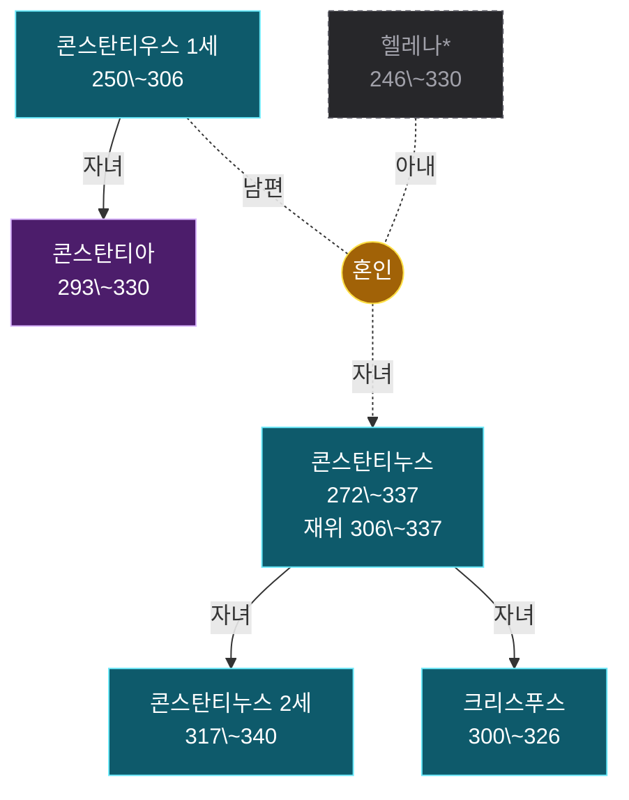

# 족보 콘스탄티누스 계열

인물 6명. 온톨로지의 혈연·혼인·계승 관계에서 생성했다 — 손으로 그린 그림이 아니라 데이터의 파생물이라, 관계를 고치고 `rome30_family.py`를 다시 돌리면 이 그림도 따라 바뀐다.

노란 동그라미가 혼인이고, 자녀는 거기서 내려온다. 상자는 그 혼인에서 난 형제다. 모든 선에 관계를 적었다 — 남편·아내·자녀, 그리고 양자·조부처럼 혈연이 아닌 계보. **점선과 흐린 칸은 이 책 본문에 없는 맥락 보강**이다. 조부·숙부가 빠지면 계보가 끊겨 보여서 외부 지식으로 보탰고, 이름 뒤 별표는 볼트에 노트가 없는 인물이다. 굵은 선은 제위 계승으로 혈연과 다른 축이다. 붉은 칸은 재위 기록이 있는 인물이다.

더 정밀한 그림은 같은 이름의 `.canvas` 파일에 있다 — 세대 번호·개인 번호·남녀 배치까지 계보도 표기를 따랐다. 표기 규칙은 [[족보_표기_설계]]에 있다.

> [!note]- 가까운 친족
>
> 그림에서 선을 따라 세면 나오는 것을 표로 옮겼다. 혈연 간선만 타므로 양자·조부처럼 대를 건너뛴 계보는 여기 들어가지 않는다. 호칭은 보는 사람의 성별과 상대의 나이에 따라 달라진다 — 같은 사람이 누구에게는 백부, 누구에게는 숙부다.
>
> | 사람 | 관계 |
> |---|---|
> | [[콘스탄티누스 2세]] | **아버지** [[콘스탄티누스]] · **조부** [[콘스탄티우스 1세]] · **조모** 헬레나\* · **고모** [[콘스탄티아]] · **형** [[크리스푸스]] |
> | [[크리스푸스]] | **아버지** [[콘스탄티누스]] · **조부** [[콘스탄티우스 1세]] · **조모** 헬레나\* · **고모** [[콘스탄티아]] · **남동생** [[콘스탄티누스 2세]] |
> | [[콘스탄티누스]] | **아버지** [[콘스탄티우스 1세]] · **어머니** 헬레나\* · **여동생** [[콘스탄티아]] · **아들** [[크리스푸스]], [[콘스탄티누스 2세]] |
> | [[콘스탄티우스 1세]] | **아들** [[콘스탄티누스]] · **손자** [[콘스탄티누스 2세]], [[크리스푸스]] · **딸** [[콘스탄티아]] · **배우자** 헬레나\* |
> | 헬레나\* | **아들** [[콘스탄티누스]] · **손자** [[콘스탄티누스 2세]], [[크리스푸스]] · **배우자** [[콘스탄티우스 1세]] |
> | [[콘스탄티아]] | **아버지** [[콘스탄티우스 1세]] · **오빠** [[콘스탄티누스]] |

### 인물

- [[콘스탄티누스]] — 로마 제국의 황제. 후계자 전쟁에서 승리하여 단독 황제가 되었으며, 비잔티움을 선택하여 콘스탄티노플이라는 새로운 수도를 건설했다.
- [[콘스탄티우스 1세]] — 디오클레티아누스의 부제로 갈리아, 에스파냐, 브리타니아를 방위했다. 랑그르 전투에서 위기에 처했으나 새로운 지휘 체계에 의해 구원받았다.
- [[콘스탄티누스 2세]] — 콘스탄티누스 사후 동방의 여러 속주를 통치한 인물. 아리우스파 사제들의 영향을 받았다.
- [[콘스탄티아]] — 콘스탄티누스 대제의 여동생이자 리키니우스의 아내. 혈연을 이용하여 리키니우스에게 마르티니아누스를 처형하도록 말해 콘스탄티누스에게 항복하게 했다.
- [[크리스푸스]] — 콘스탄티누스의 아들로, 리키니우스 함대와의 해전에서 아반두스 함대를 격파하여 제해권을 확보했다.
- 헬레나\* — 콘스탄티우스 1세의 아내, 콘스탄티누스의 어머니 (본문 밖 보강)
