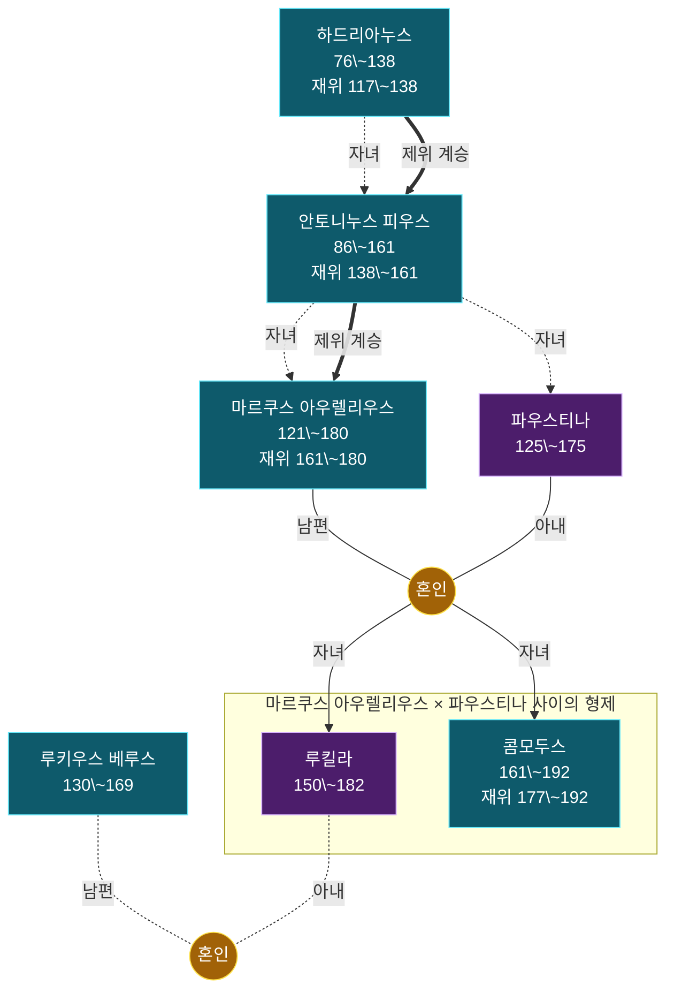

# 족보 콤모두스 계열

인물 7명. 온톨로지의 혈연·혼인·계승 관계에서 생성했다 — 손으로 그린 그림이 아니라 데이터의 파생물이라, 관계를 고치고 `rome30_family.py`를 다시 돌리면 이 그림도 따라 바뀐다.

노란 동그라미가 혼인이고, 자녀는 거기서 내려온다. 상자는 그 혼인에서 난 형제다. 모든 선에 관계를 적었다 — 남편·아내·자녀, 그리고 양자·조부처럼 혈연이 아닌 계보. **점선과 흐린 칸은 이 책 본문에 없는 맥락 보강**이다. 조부·숙부가 빠지면 계보가 끊겨 보여서 외부 지식으로 보탰고, 이름 뒤 별표는 볼트에 노트가 없는 인물이다. 굵은 선은 제위 계승으로 혈연과 다른 축이다. 붉은 칸은 재위 기록이 있는 인물이다.

더 정밀한 그림은 같은 이름의 `.canvas` 파일에 있다 — 세대 번호·개인 번호·남녀 배치까지 계보도 표기를 따랐다. 표기 규칙은 [[족보_표기_설계]]에 있다.

> [!note]- 가까운 친족
>
> 그림에서 선을 따라 세면 나오는 것을 표로 옮겼다. 혈연 간선만 타므로 양자·조부처럼 대를 건너뛴 계보는 여기 들어가지 않는다. 호칭은 보는 사람의 성별과 상대의 나이에 따라 달라진다 — 같은 사람이 누구에게는 백부, 누구에게는 숙부다.
>
> | 사람 | 관계 |
> |---|---|
> | [[루킬라]] | **아버지** [[마르쿠스 아우렐리우스]] · **조부** [[안토니누스 피우스]] · **증조부** [[하드리아누스]] · **어머니** [[파우스티나]] · **외조부** [[안토니누스 피우스]] · **증외조부** [[하드리아누스]] · **고모** [[파우스티나]] · **외삼촌** [[마르쿠스 아우렐리우스]] · **남동생** [[콤모두스]] · **배우자** [[루키우스 베루스]] |
> | [[콤모두스]] | **아버지** [[마르쿠스 아우렐리우스]] · **조부** [[안토니누스 피우스]] · **증조부** [[하드리아누스]] · **어머니** [[파우스티나]] · **외조부** [[안토니누스 피우스]] · **증외조부** [[하드리아누스]] · **고모** [[파우스티나]] · **외삼촌** [[마르쿠스 아우렐리우스]] · **누나** [[루킬라]] |
> | [[안토니누스 피우스]] | **아버지** [[하드리아누스]] · **아들** [[마르쿠스 아우렐리우스]] · **손녀** [[루킬라]] · **손자** [[콤모두스]] · **딸** [[파우스티나]] · **외손녀** [[루킬라]] · **외손자** [[콤모두스]] |
> | [[마르쿠스 아우렐리우스]] | **아버지** [[안토니누스 피우스]] · **조부** [[하드리아누스]] · **여동생** [[파우스티나]] · **딸** [[루킬라]] · **아들** [[콤모두스]] · **배우자** [[파우스티나]] |
> | [[파우스티나]] | **아버지** [[안토니누스 피우스]] · **조부** [[하드리아누스]] · **오빠** [[마르쿠스 아우렐리우스]] · **딸** [[루킬라]] · **아들** [[콤모두스]] · **배우자** [[마르쿠스 아우렐리우스]] |
> | [[하드리아누스]] | **아들** [[안토니누스 피우스]] · **손자** [[마르쿠스 아우렐리우스]] · **손녀** [[파우스티나]] |
> | [[루키우스 베루스]] | **배우자** [[루킬라]] |

### 인물

- [[마르쿠스 아우렐리우스]] — 5현제 시대의 마지막 황제. 자비심이 많았지만 친인척에게 과한 관용을 베풀었고, 심약한 콤모두스를 후계자로 지목한 것을 후회했다.
- [[콤모두스]] — 마르쿠스 아우렐리우스의 아들. 심약한 청년으로 시작했으나 암살 시도 후 폭군이 되어 무고한 원로원 의원들을 살해하고 검투사로서 활약했으며 결국 부하에게 목졸려 죽
- [[루킬라]] — 마르쿠스 아우렐리우스의 딸. 루키우스 베루스와 결혼하도록 제의받았으나 루키우스는 여전히 주색 잡기에만 빠져 있었다.
- [[안토니누스 피우스]] — 하드리아누스 후기에 후계자로 지명된 황제. 전 재산을 국고에 쏟아 붓고 법전을 정리했다.
- [[파우스티나]] — 마르쿠스 아우렐리우스의 아내. 천박한 바람기로 많은 애인을 두었지만, 황제는 이를 모르고 그녀를 정숙한 여신으로 신격화했다.
- [[루키우스 베루스]] — 마르쿠스 아우렐리우스가 동방으로 파견한 장군. 향락가였으나 파르티아족을 격파했다.
- [[하드리아누스]] — 고대 로마사상 가장 위대한 황제로 불리는 인물. 동방 정복을 종결하고 법전을 정리했다.
