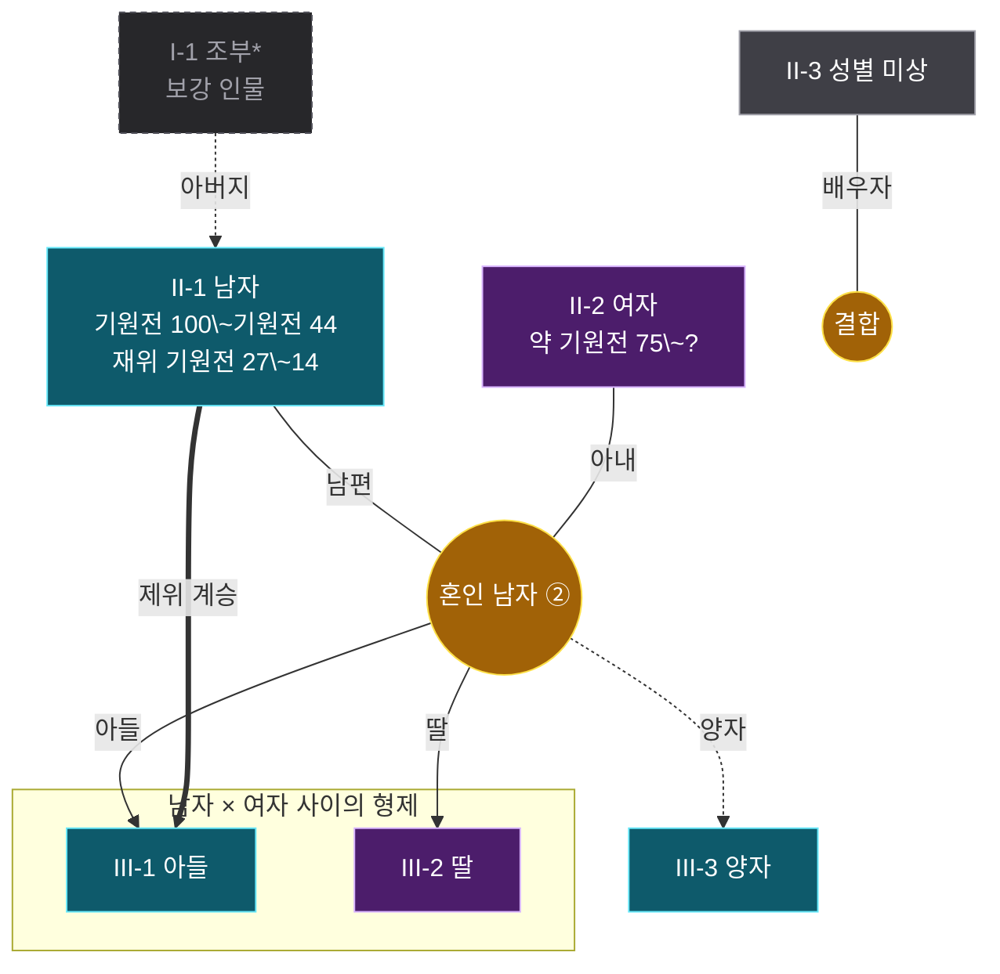

# 족보 표기 설계

이 볼트의 족보를 어떤 규칙으로 그리는지 정한 문서다. Mermaid와 Canvas 두 그릇을 쓰는데, **모델은 하나이고 그릇만 둘**이다. 둘 다 `ontology/links.jsonl`에서 생성되며 손으로 그리지 않는다.

---

## 판정 기준 — 촌수가 세어지는가

족보 표기가 맞았는지 판정하는 방법은 하나다. **선을 따라가서 촌수가 나와야 한다.**

촌수는 혈연 간선의 개수다. 부모–자식이 1촌, 형제는 나를 거쳐 부모로 올라갔다 내려오니 2촌, 삼촌이 3촌, 사촌이 4촌이다. 이게 안 나오면 그림이 예뻐도 족보가 아니다.

여기서 규칙 하나가 강제된다.

> **혼인 노드는 촌수에 세지 않는다.** 세는 것은 세대선(부모→혼인→자식의 위아래 방향)뿐이고, 배우자로 이어진 가로 방향은 0촌이다.

부부가 무촌인 것과 같은 이치다. 실제로 세어 보면 맞는다.

| 두 사람 | 경로 | 촌수 |
|---|---|---|
| 게르마니쿠스 ↔ 클라우디우스 | 각자 부모의 혼인까지 1, 다시 내려와 1 | **2촌**(형제) |
| 티베리우스 ↔ 게르마니쿠스 | 게르마니쿠스→드루수스 1, 드루수스→부모혼인 1, 티베리우스 1 | **3촌**(숙질) |
| 칼리굴라 ↔ 네로 | 네로→소아그리피나 1, →게르마니쿠스 1, →칼리굴라 1 | **3촌**(외숙질) |

배우자를 거쳐 가는 경로는 세지 않으므로, 아우구스투스와 게르마니쿠스처럼 혼인으로만 이어진 관계는 혈연 촌수가 성립하지 않는다. 그건 결함이 아니라 사실이다.

---

## 따른 표준

셋을 섞었다. 어느 것도 통째로는 맞지 않기 때문이다.

**임상 계보도(pedigree chart)** — 가장 엄격한 표기다. 여기서 가져온 것은 세대 로마숫자, `II-3` 꼴 개인 번호, 남자를 왼쪽·여자를 오른쪽에 세우는 배치, 부부를 혼인 지점으로 잇고 거기서 자녀가 내려오는 구조다.

**GEDCOM** — 계보 데이터의 사실상 표준. 개인(INDI)과 **가족(FAM)** 두 레코드로 나눈다. 혼인을 사람 사이의 선이 아니라 하나의 레코드로 본다는 발상을 여기서 가져왔다.

**한국 족보** — 세(世)로 대를 세고, 양자를 계자(系子)로 적되 **생부를 따로 남긴다.** 양자를 친자로 뭉개지 않는다는 원칙을 가져왔다.

---

## 객체 셋

| 객체 | 무엇 | 근거 데이터 |
|---|---|---|
| **인물** | 한 사람 | `entities.jsonl`의 `type: person` |
| **혼인** | 한 쌍의 결합. 자녀가 여기서 나온다 | `child_of`의 부모 조합, `married` |
| **묶음** | 그 혼인에서 난 형제 | 위에서 유도 |

혼인을 노드로 둔 것이 이 설계의 전부다. 그러면 다음이 저절로 풀린다.

- **재혼** — 한 사람이 혼인 노드 여럿에 붙는다. 노드에 `리비아 드루실라 ② · 아우구스투스 ③`처럼 그 사람 기준의 차수를 원 숫자로 적는다
- **이복형제** — 자식이 어느 혼인 노드에 달렸는지로 갈린다
- **양자** — 혼인에서 나가는 선에 `양자`라고 적는다. 친자 선과 같은 굵기지만 말이 다르다
- **형제** — 같은 혼인에서 나온 자녀들. 상자로 두른다

---

## 채널 배정

**한 채널은 한 뜻만 진다.** 색이 성별과 재위를 겸하면 아무것도 안 읽힌다.

| 채널 | 뜻 | 값 |
|---|---|---|
| 칸 색 | **성별** | 청록 = 남 · 보라 = 여 · 무색 = 미상 |
| 칸 글자 | 생몰년·재위 | `기원전 63~14` / `재위 기원전 27~14` 줄이 있으면 황제 |
| 칸 앞 번호 | 개인 식별 | `II-3` = 2세대 3번. 사람을 지목할 때 쓴다 |
| 가로 위치 | 성별·형제 | 남자 왼쪽, 여자 오른쪽. 형제는 인접 |
| 세로 위치 | 세대 | 한 행이 한 세대 |
| 노란 동그라미 | 혼인 | 여러 번이면 `이름 ②` 꼴 원 숫자 |
| 노란 상자 | 형제 | 한 혼인에서 난 자녀들 |
| 초록 상자 | 가문 | 혈연으로 이어진 덩어리 전체 |
| 선 위의 말 | **관계** | 남편 · 아내 · 아들 · 딸 · 자녀 · 양자 · 조부 · 외조카·양자 · 외숙모 |
| 주황 굵은 선 | 제위 계승 | 혈연과 다른 축이다 |

**무색은 모른다는 뜻이지 틀렸다는 뜻이 아니다.** 성별은 온톨로지에 없어서 사람이 선언한다. 선언에 없으면 무색으로 남긴다.

---

## 두 그릇

같은 데이터에서 둘 다 나온다. 버리는 쪽이 없다.

| | Mermaid (`.md` 안) | Canvas (`.canvas`) |
|---|---|---|
| 배치 | **자동.** 세대 행을 보장 못 한다 | **지정.** 세대가 행으로 고정된다 |
| 개인 번호 | 없음 | `II-3` |
| 노트로 이동 | **불가**(실측) | **가능.** 칸 안이 위키링크 |
| 상자 | `subgraph` | 그룹 노드. 겹쳐 쌓기 가능 |
| 이미지 | 불가 | 가능 |
| 인쇄·모바일 | **강함.** 본문에 인라인 | 파일을 따로 연다 |

**Mermaid는 훑는 용도, Canvas는 따지는 용도**로 쓴다. 노트를 열면 Mermaid가 바로 보이고, 정확히 따질 일이 있으면 같은 이름의 `.canvas`를 연다.

Excalidraw는 쓰지 않는다. 예쁘게 그릴 수는 있지만 **그리는 순간 데이터와 갈라지고**, 관계를 고칠 때마다 사람이 그림을 다시 손봐야 한다. 안 하면 그림이 조용히 거짓말을 시작한다.

---

## 친족 호칭 — 그래프에서 계산한다

"할아버지가 누구인지 알 수 있어야 한다"는 요구의 답이다. 그림은 세대를 보여주지만 호칭을 말해주지 않는다. 그래서 각 족보 노트에 `### 가까운 친족` 표를 생성한다.

계산 규칙은 촌수와 같다 — **혈연 간선만 탄다.** 양자·조모처럼 `KIN`으로 선언된 계보는 대를 건너뛰므로 제외한다.

| 만드는 호칭 | 근거 |
|---|---|
| 아버지 · 어머니 | 친부모 간선 |
| 조부 · 조모 / **외**조부 · **외**조모 | 아버지 쪽인지 어머니 쪽인지로 가른다 |
| 증조부 · 증조모 (증외조부 …) | 한 대 더 |
| 형 · 오빠 · 누나 · 언니 · 남동생 · 여동생 | 부모를 공유 + **양쪽 생년을 안다.** 보는 쪽과 상대의 성별·나이가 다 필요하다 |
| 형제 · 자매 (뭉뚱그린 꼴) | 부모는 공유하는데 둘 중 하나라도 생년이 없을 때 |
| 이복 형제·자매 | **양쪽 부모가 다 기록됐는데 다를 때만** 이복이다 |
| 백부 · 숙부 / 고모 · 외삼촌 · 이모 | 부모의 형제자매. 아버지 쪽 남자는 아버지보다 손위면 백부, 손아래면 숙부 |
| 아들 · 딸 · 손자 · 손녀 · 외손자 · 외손녀 | 역방향 |
| 배우자 | 혼인 |

나이가 필요한 호칭은 `ontology/_family/birthyears.json`이 받친다. 사람이 조사해 적은 표다 — 항목 41개에 `CONTEXT_PEOPLE`의 연도 4개가 더해져 **45명**분이 걸린다(2026-07-31).

**생년이 없는 사람은 호칭을 지어내지 않고 `형제`·`자매`로 뭉뚱그린다.** 현재 그런 사람이 7명이다 — 비길란티아·스크리보니아·아브 탈리브·아브드 알 무탈리브·아카키우스·하심·황비 루피키나. 이 목록은 표를 채울수록 줄어드니, 세려면 세지 말고 물어라.

```python
# 족보에 나오는데 생년이 없는 사람
by = fam.born()
{n for c in fam.clusters(child, marry) if len(c) >= 3 for n in c
 if by.get(n, {}).get('born') is None}
```

한국어 친족 호칭은 아버지 쪽과 어머니 쪽을 가른다. 이 규칙 하나가 표의 절반을 만든다 — 네로의 조부가 아니라 **외조부**가 게르마니쿠스다.

---

## 이 모델이 실제로 잡아낸 오류

혼인 노드 모델과 친족 계산은 장식이 아니다. 표로는 안 보이던 오류가 그림과 호칭에서 드러났다.

| 증상 | 실제 원인 |
|---|---|
| 카이사르의 가정이 텅 비었다 | 혼인이 `succeeded`로 잘못 분류돼 있었다. 칼푸르니아는 객체만 있고 관계가 0건 |
| 아우구스투스가 율리아의 부모이자 자식 | `율리아` 하나에 카이사르의 딸과 아우구스투스의 딸이 뭉쳐 있었다 |
| 23명이 한 줄로 뭉갬 | 부모 집합 `{카이사르(양자), 율리아(조모)}`가 **카이사르와 그의 딸을 부부로** 만들었다 |
| 세대 사이에 4만 7천 픽셀 빈칸 | 순환이 남아 세대 계산이 발산했다 |
| 친형제가 이복으로 | 한쪽만 부모 기록이 있으면 이복이 아니라 미상이다 |
| 칼리굴라의 형제가 네로 | 대 아그리피나와 소 아그리피나를 혼동. 네로의 어머니는 소 아그리피나 |
| 증조부 리비아 드루실라 | 증조 호칭이 조부의 성별을 물려받았다. 호칭의 성별은 그 사람 자신의 것이다 |
| 콘스탄티아가 콘스탄티누스의 딸 | 서술은 "여동생"이다 |
| 아우구스투스가 13살 위 사람의 손자 | 두 율리아를 갈랐는데 **조모 간선이 딸 쪽에 남아 있었다.** 외조모는 카이사르의 *누이*(동명이인)다 |
| 유스티니아누스의 "백모" | 어머니 비길란티아가 유스티누스의 누이다. 백모가 아니라 **외숙모**. 스크립트 안에서 `CONTEXT` 주석과 `KIN` 표가 서로 어긋나 있었다 |
| 소 아그리피나가 서기 28년생 | 실제는 15년생. `confidence: high`가 붙어 있어 더 위험했다 |
| 하드리아누스·안토니누스 피우스·루키우스 베루스가 무색 | 성별 선언에서 빠져 남자가 미상으로 그려졌다 |

**모두 그려보고 나서야 보였다.** JSONL을 아무리 들여다봐도 안 나온다. 마지막 다섯 줄은 그림이 다 나온 뒤 **사실 대조를 따로 한 번 더 돌려서** 나왔다 — 그리는 것으로 잡히는 오류와 사실인지 따져야 잡히는 오류는 다르다.

`--check`가 못 잡는 종류가 있다는 것도 여기서 드러났다. 검사기는 `KIN`으로 선언된 관계의 생몰년 검산을 건너뛴다(양자·조부는 나이 규칙이 다르므로 당연하다). 그래서 "조모가 손자보다 13살 위"가 통과했다. **사람이 선언한 것은 기계가 검사하지 않는다** — 선언 표는 주기적으로 사실 대조를 받아야 한다.

---

## 실측으로 확인한 함정

전부 실제로 렌더해서 확인한 것들이다. 추측이 아니다.

- **Mermaid 간선 라벨에 괄호를 쓰면 도표 전체가 죽는다.** `-->|계자(양자)|`의 `(`를 도형 시작으로 읽는다. 라벨 전용 이스케이프로 `·`로 바꾼다
- **Mermaid 노드 글자의 괄호는 `#40;`·`#41;`** 로 쓴다. HTML 엔티티 `&#40;`로 쓰면 `&(`가 그대로 보인다
- ★ **물결(`~`)은 `\~`로 죽인다.** 생몰년을 칸에 넣는 순간 걸렸다 — 한 칸에 물결이 둘이면 그 사이를 취소선으로 읽고 `Unsupported markdown: del`을 글자로 뱉는다. **문법이 아니라 라벨을 굽는 단계에서 깨지므로 `mermaid.parse()`로는 안 잡힌다.** 자세한 것과 검사법은 「Mermaid 문법」 절에
- **Mermaid의 `click`은 쓰지 않는다.** 맨 노트 이름을 주면 앵커는 생기지만 눌러도 이동하지 않고, `obsidian://` URI를 주면 파싱이 깨져 도표가 통째로 안 그려진다
- **Canvas 세로 간격은 간선 라벨의 자리다.** 좁으면 관계 표시가 겹쳐 안 보인다. 현재 424px(칸 높이 104 + `GAP_Y` 320)
- **세대 계산의 두 규칙은 둘 다 "올리기만" 해야 한다.** 배우자 동기화가 올린 세대를 부모 규칙이 도로 끌어내리면 순환이 없어도 영원히 핑퐁하다 60회 상한에 걸린다. `max(부모+1, 지금값)`으로 단조 증가시켜야 멈춘다
- **Canvas의 z축은 배열 순서다.** 가문 상자 → 형제 상자 → 노드 순으로 넣어야 다 보인다
- **부모 기록이 없으면 0세대로 튀어 오른다.** 배우자끼리 세대를 동기화해야 안토니아가 카이사르 옆에서 내려온다
- **생성 스크립트의 정리 패턴을 넓게 잡으면 손으로 쓴 문서를 지운다.** 이 문서가 실제로 한 번 지워졌다. `족보_*.md`가 아니라 `족보_*_계열.md`로 좁혀야 한다
- **혼인은 친부모 쌍에서만 유추한다.** 부모 집합이 둘이면 부부로 보는 규칙은 양자·조모가 섞이는 순간 무너진다
- **세대 계산에 상한과 경고를 건다.** 순환이 남으면 발산해서 4만 픽셀짜리 캔버스를 조용히 뱉는다. 사람 수를 넘는 세대는 있을 수 없다
- **Canvas는 파일이 밖에서 바뀌어도 열린 뷰를 갱신하지 않는다.** 탭을 닫았다 다시 열어야 새 그림이 보인다. Mermaid도 노트를 다시 열어야 한다
- **집합의 순회 순서는 실행마다 다르다.** 파이썬이 문자열 해시를 프로세스마다 무작위화한다. `set`·`frozenset`을 도는 자리는 **전부 `sorted()`로 감싼다.** 안 하면 간선 순서와 노드 id가 매번 바뀌어 멱등이 깨지고, `next(iter(부모집합))` 같은 코드는 **양자 라벨이 붙었다 말았다 한다**
- 멱등 검사는 같은 프로세스에서 두 번 돌리는 것으로 부족하다. `PYTHONHASHSEED`를 바꿔가며 확인해야 이 함정이 드러난다

  ```
  for s in 1 999 12345; do PYTHONHASHSEED=$s python3 …_family.py --write; md5 -q family/*.md; done
  ```

---

## 아직 못 하는 것

**시간.** 세로축은 세대이지 연대가 아니다. 재혼의 순서는 차수로 적지만 언제였는지는 그림에 없다. `links.jsonl`에 `from_year`·`to_year`가 있으니 혼인 노드에 연도를 적는 것까지는 싸게 된다. 세로축을 시간으로 바꾸면 정확해지지만 족보처럼 안 읽힌다.

**집단·종교 레이어.** 물어볼 수는 있으나 데이터가 없다. 율리우스-클라우디우스 19명 중 `member_of`가 있는 사람은 `카이사르 → 민중파` 하나뿐이다. 없는 걸 상자로 두르면 그럴듯한 거짓말이 된다. 본문에서 소속을 뽑는 추출을 한 번 더 돌려야 생긴다.

**생부 병기.** 한국 족보는 양자의 생부를 따로 남긴다. 지금은 `양자` 라벨만 있고 생부 정보가 데이터에 없다.

**책과 정사가 갈릴 때.** 이 족보는 *이 책*의 서술을 옮긴 것이다. 갈리는 자리가 실제로 있다.

| 자리 | 책 | 통설 | 이 그림 |
|---|---|---|---|
| 클라우디우스의 아그리피나 | 다섯 번째 아내(11번) | 넷째. 파혼한 약혼은 세지 않는다 | 책을 따라 ⑤. 차이는 `SPOUSE_SEQ` 주석에 |
| 유스티누스와 유스티니아누스 | 백부(26번) | 외삼촌 | 사실을 따라 **외숙모·외조카** |

**규칙은 하나다 — 어느 쪽을 택했든 그 근거를 선언 표의 주석에 남긴다.** 지금은 자리마다 판단이 갈리는데, 나중에 "책 우선 / 사실 우선"을 한쪽으로 정하고 싶어지면 주석이 있어야 옮길 수 있다.

---

## 입력 데이터

두 파일만 읽는다. 둘 다 `rome30_merge.py`가 `ontology/_parts/*.jsonl`에서 생성한다.

`ontology/entities.jsonl` — 한 줄에 객체 하나.

```json
{"id": "person:아우구스투스", "name": "아우구스투스", "type": "person",
 "aliases": ["Augustus", "옥타비아누스"], "attrs": {"reign": "-27~14"},
 "points": [8, 9, 10], "desc": "…", "note": "아우구스투스"}
```

쓰는 필드는 `name` · `type`(`person`만) · `attrs.reign` · `points` 넷이다. `reign`의 기원전은 음수다.

`ontology/links.jsonl` — 한 줄에 관계 하나.

```json
{"from": "person:칼리굴라", "to": "person:게르마니쿠스", "rel": "child_of",
 "point": 11, "from_year": null, "to_year": null, "year_basis": null}
```

쓰는 `rel`은 셋이다. **`child_of`는 A가 B의 자식**이라는 뜻이다(방향 주의). `married`는 무방향, `succeeded`는 제위 계승이다.

---

## 파이프라인에서의 위치

족보는 온톨로지의 **파생물**이다. 앞 단계를 다시 돌리면 족보도 다시 돌려야 한다.

```
_parts/*.jsonl
   └─ rome30_merge.py ──→ entities.jsonl · links.jsonl · entities/*.md
                             ├─ rome30_family.py ──→ family/*.md      (Mermaid)
                             └─ rome30_canvas.py ──→ family/*.canvas  (Canvas)
```

`merge.py`의 `CANON`(표기 통일)과 `SPLIT`(동명이인 분리)이 **객체 이름을 바꾼다.** 족보의 판단 표는 이름으로 적혀 있으므로, 이름이 바뀌면 표가 아무것도 안 가리키게 된다. 그래서 검사기가 있다(아래).

---

## 사람의 판단이 사는 곳

기계가 정할 수 없는 것은 전부 **선언**이고, 근거를 옆에 적는다. 그림을 고치지 말고 여기를 고친다.

| 표 | 파일 | 무엇 |
|---|---|---|
| `SPLIT` | `rome30_merge.py` | 한 이름에 두 사람이 뭉친 것을 (이름, 포인트)로 가른다 |
| `CANON` | `rome30_merge.py` | 같은 사람의 다른 표기를 하나로 |
| `DROP` | `rome30_family.py` | 틀린 혈연 간선을 버린다 |
| `ADD` | `rome30_family.py` | 본문에 있는데 추출이 놓친 혈연을 보탠다 |
| `MARRY_ADD` | `rome30_family.py` | 놓쳤거나 `succeeded`로 잘못 들어온 혼인 |
| `SUCC_IS_MARRIAGE` | `rome30_family.py` | 계승 목록에서 뺄 것(실은 혼인) |
| `KIN` | `rome30_family.py` | 혈연이 아닌 계보 — 양자·조부·의붓아버지. **혼인 유추와 촌수 계산에서 제외된다** |
| `FEM_HINT` · `MAL_HINT` | `rome30_family.py` | 성별. **여기 한 곳뿐이다.** 캔버스는 이걸 가져다 쓴다 |
| `SPOUSE_SEQ` · `UNION_LABEL` | `rome30_family.py` | 혼인 서수와 예외 표기 |
| `CONTEXT_PEOPLE` · `CONTEXT` · `CONTEXT_MARRY` | `rome30_family.py` | 본문 밖 맥락 보강. 점선으로 그려진다 |
| `birthyears.json` | `ontology/_family/` | 생몰년. 나이가 필요한 호칭이 여기서 나온다. `confidence`로 추정임을 밝힌다 |

성별을 두 파일에 각각 두면 한쪽만 고쳐져 두 그림의 색이 갈라진다. 실제로 한 번 그랬다.

**선언에는 반드시 근거를 붙인다.** `DROP`은 값 자체가 이유 문장이고, 나머지는 옆에 주석을 단다. 근거 없는 선언은 다음 사람이 고칠 수도 지울 수도 없다 — 그리고 이 표들은 **기계가 검사하지 않는 자리**다(`--check`는 이름이 실재하는지만 본다). 근거 문장이 곧 검사다.

---

## 표기 견본 — 이 그림이 곧 범례다

아래는 실제로 렌더되는 Mermaid다. 이 문서가 말하는 모든 표기가 한 장에 들어 있다.



읽는 법은 이렇다.

| 보이는 것 | 뜻 |
|---|---|
| 청록 칸 | 남자 |
| 보라 칸 | 여자 |
| 회색 칸 | 성별 미상. 모른다는 뜻이지 틀렸다는 뜻이 아니다 |
| 점선 테두리 · 이름 뒤 별표 | 이 책 본문에 없는 **맥락 보강**. 볼트에 노트도 없다 |
| `II-1` | 세대-개인 번호. 사람을 지목할 때 쓴다 |
| 둘째 줄 | 생몰년. `약`이 붙으면 추정, `?`는 미상 |
| 셋째 줄 | 재위. 있으면 황제다 |
| 노란 원 | 혼인. `남자 ②`는 그 사람 기준 두 번째 혼인이라는 뜻 |
| 상자 | 한 혼인에서 난 형제 |
| 실선 화살표 | 본문에 근거가 있는 관계 |
| **점선 화살표** | 보강 관계. 근거의 등급이 다르다 |
| 굵은 화살표 | 제위 계승. 혈연과 다른 축 |

**근거의 등급이 다른 것을 같은 실선으로 그리지 않는다.** 이게 이 표기의 핵심 원칙이다 — 조부·숙부를 넣어 맥락을 살리되, 그것이 책에서 온 것이 아님을 눈으로 알 수 있어야 한다.

Canvas에는 점선이 없다. 대신 **간선 색을 흐리게**(`#52525b`) 하고 이름 뒤에 별표를 붙인다. 뜻은 같다.

---

## 모듈 구조

두 스크립트뿐이고, **`rome30_family.py`가 본체**다. 캔버스는 그 위에 얹힌 렌더러다.

```
rome30_family.py  ── 데이터·판단·계산·Mermaid 렌더
      ▲
      │ import (판단 표·성별·생몰년·촌수 계산을 전부 가져다 쓴다)
      │
rome30_canvas.py  ── 배치·Canvas 렌더만
```

캔버스가 판단 표를 **사본으로 갖지 않는다.** 성별을 두 곳에 두었다가 한쪽만 고쳐져 두 그림의 색이 갈라진 적이 있다. 지금은 `main()`에서 `fam.FEM_HINT` 등을 끌어와 전역에 채운다.

### `rome30_family.py`의 부품

| 부품 | 종류 | 하는 일 |
|---|---|---|
| `DROP` `ADD` `MARRY_ADD` `SUCC_IS_MARRIAGE` `KIN` | 판단 표 | 추출 오류를 근거와 함께 고친다 |
| `SPOUSE_SEQ` `UNION_LABEL` | 판단 표 | 혼인 서수(①②③)와 예외 표기 |
| `CONTEXT_PEOPLE` `CONTEXT` `CONTEXT_MARRY` | 판단 표 | 본문에 없는 맥락 보강. `CTX_EDGES`로 합쳐져 점선 판정에 쓰인다 |
| `FEM_HINT` `MAL_HINT` | 판단 표 | 성별. **여기가 유일한 원본** |
| `load()` | 데이터 | JSONL → `(ents, child, marry, succ)`. 판단 표를 여기서 적용한다 |
| `clusters()` | 계산 | 혈연·혼인을 무방향으로 보고 가문 덩어리를 찾는다 |
| `kinship()` | 계산 | 조부·숙부·형·누나 계산. 촌수 규칙과 같은 원리 |
| `born()` `life_ko()` | 데이터 | `_family/birthyears.json` 적재와 표기 |
| `reign_ko()` `union_label()` | 표기 | 기원전 음수 → 한글, 혼인 서수 |
| `MERMAID_ESC` `EDGE_ESC` | 표기 | 문법을 깨뜨리는 문자 씻기. **둘은 규칙이 다르다** — 노드 글자는 `#40;`·`\~`, 간선 라벨은 `·` |
| `mermaid()` | 렌더 | Mermaid 소스 문자열 |
| `note()` | 렌더 | 노트 전체(프론트매터·본문·친족 콜아웃·인물 목록) |
| `check()` | 검사 | 다섯 가지 불변조건 |

### `rome30_canvas.py`의 부품

| 부품 | 하는 일 |
|---|---|
| `W H UW UH GAP_X GAP_Y` | 칸 크기와 간격. **세로 간격은 간선 라벨의 자리다** |
| `COL` `DIM` | 색. 성별 3색 + 혼인 + 보강 흐림 |
| `sex()` | `fam.FEM_HINT`/`MAL_HINT`를 본다 |
| `generations()` | 세대 계산 + 배우자 동기화 + 발산 방지 |
| `build()` | 좌표 배치와 JSON 조립. `ROMAN`으로 `II-3` 번호를 만든다 |

---

## Mermaid 문법 — 이 족보가 쓰는 것만

전부 실제로 렌더해 확인한 것이다. 버전을 타는 문법은 피했다.

```
graph TD                          방향. TD는 위→아래
  n0["카이사르<br/>기원전 100\~기원전 44"]     사각 칸. <br/>로 줄바꿈. 물결은 \~로
  u1(("혼인 카이사르 ②"))                    원형 칸. 혼인 노드
  n0 ---|남편| u1                            무방향 실선 + 라벨
  u1 -->|아들| n1                            화살표 실선 + 라벨
  u1 -.->|양자| n2                           점선. 보강 관계
  n3 ==>|제위 계승| n4                        굵은 선. 혈연이 아닌 축
  subgraph s1["드루수스 × 안토니아 사이의 형제"]   상자
    n1
    n2
  end
  classDef mal fill:#0e5a6b,stroke:#67e8f9,color:#fff
  class n0,n1 mal                            클래스 적용은 별도 문으로
```

### 반드시 지킬 문법 규칙

- **간선 라벨에 `(` `)` 를 쓰면 도표 전체가 죽는다.** 파서가 도형 시작으로 읽는다. `EDGE_ESC`가 `·`로 바꾼다
- **노드 글자의 괄호는 `#40;` `#41;`** 다. HTML 엔티티 `&#40;`로 쓰면 화면에 `&(`가 그대로 보인다. `MERMAID_ESC`가 처리한다
- ★ **노드 글자의 물결은 `\~`로 죽인다.** 라벨은 GFM으로 한 번 더 구워지므로, 한 칸에 물결이 둘이면(`86~161<br/>재위 138~161`) 그 사이를 취소선으로 읽고 **`Unsupported markdown: del`을 글자로 뱉는다.** 한국식 연도 범위를 쓰는 순간 걸린다. `#126;` 엔티티는 안 통하고 백슬래시만 통한다 — 셋 다 실측했다. `MERMAID_ESC`가 처리한다
- **노드 글자에 진짜 줄바꿈을 넣으면 깨진다.** 반드시 `<br/>`
- **`:::클래스`를 도형 선언에 붙이지 않는다.** 버전을 탄다. `class n0,n1 mal`처럼 별도 문으로
- **`click`은 쓰지 않는다.** 맨 노트 이름은 앵커만 생기고 이동하지 않으며, `obsidian://` URI는 파싱을 깨뜨린다. 노트로 가는 길은 아래 인물 목록의 위키링크다
- subgraph 안에는 **노드 id만** 적는다. 이미 위에서 선언한 것을 옮겨 담는 문법이다

### 오류를 확인하는 법

**깨지는 방식이 두 가지고, 둘은 다른 자리에서 잡힌다.**

| 종류 | 언제 | 어디에 나오는가 |
|---|---|---|
| **파싱 실패** | 문법이 틀렸다(간선 라벨의 괄호 등) | 도표가 통째로 안 그려지고 `<pre>`에 `Error parsing Mermaid diagram!` 텍스트 |
| **굽기 실패** | 문법은 맞는데 라벨 글자를 마크다운으로 읽다 막혔다(물결 등) | **도표는 그려지고** 그 칸의 글자만 `Unsupported markdown: del`로 바뀐다 |

둘 다 **콘솔에 안 나오고** `.mermaid .error` 선택자로도 안 잡힌다. 그리고 결정적으로 —

★ **`mermaid.parse()`도 `mermaid.render()`도 굽기 실패를 못 잡는다.** 물결 사고는 둘 다 통과하고 **노트에서만** 터졌다. Obsidian이 자기 설정(`htmlLabels: false`)으로 초기화한 상태에서 라벨을 마크다운으로 한 번 더 굽기 때문이다. mermaid를 직접 부르는 검사는 **내 설정으로 도는 다른 파이프라인**이라 실제와 다르다.

그러므로 **Obsidian의 렌더러를 그대로 부른다.** 화면에 붙지 않은 `div`에 그려도 되므로 창이 뒤에 있어도 된다.

```js
// obsidian eval. 마이크로태스크는 조여지지 않으므로 .then은 백그라운드에서도 돈다
const fs = require("fs"), O = require("obsidian"), dir = "…/family/";
const el = document.createElement("div"); document.body.appendChild(el);
const c = new O.Component(), jobs = [];
for (const f of fs.readdirSync(dir).filter(x => x.endsWith(".md"))) {
  const t = fs.readFileSync(dir + f, "utf8"), re = /```mermaid\n[\s\S]*?\n```/g;
  let m; while ((m = re.exec(t))) {
    const box = el.createDiv();
    jobs.push(Promise.resolve(O.MarkdownRenderer.render(app, m[0], box, f, c))
      .then(() => f + (/Unsupported markdown|Error parsing/.test(box.innerText)
                       ? " FAIL " + box.innerText.slice(0, 80) : " OK")));
  }
}
Promise.all(jobs).then(r => fs.writeFileSync("/tmp/mr.out", r.join("\n")));
```

**DOM을 직접 보려 하면 두 번 막힌다.**

- **Obsidian 창이 뒤에 있으면 렌더가 멈춘다.** 크로뮴이 백그라운드 창의 타이머를 조인다. `setTimeout`으로 기다리는 검사는 영원히 안 끝나고 `contentEl.innerText`가 11자로 나온다. 파일은 멀쩡한데 "안 그려졌다"는 오진이 난다
- **`obsidian eval`의 최상위 `async` 함수는 첫 `await` 뒤로 재개되지 않는다.** 마이크로태스크(`.then`)는 도므로, 결과를 **파일로 떨궈서** 셸에서 읽는다

위 코드가 둘 다 피해 간다 — 보이지 않는 `div`에 그리고, `.then`으로 잇고, 파일로 뱉는다.

---

## 알고리즘

새로 구현하는 사람을 위한 명세다.

1. **불러오기** — `links.jsonl`에서 `child_of`·`married`·`succeeded`를 꺼내고, `DROP`을 빼고 `ADD`·`MARRY_ADD`를 더한다. `SUCC_IS_MARRIAGE`는 계승에서 제외한다.
2. **가문 나누기** — 혈연·혼인을 무방향으로 보고 연결 요소를 찾는다. 3명 이상만 그린다.
3. **친부모 집합** — 각 사람의 부모 중 `KIN`으로 선언된 것을 뺀 나머지. 이게 혼인 유추와 촌수의 근거다.
4. **혼인 노드** — 친부모 집합이 2명 이상인 자녀들을 그 집합으로 묶는다. 자녀 없는 혼인은 `married`에서 따로 만든다.
5. **세대** — 친부모 사슬의 최장 길이. 그다음 **배우자끼리 같은 세대로 맞춘다**(부모 기록이 없는 배우자가 0세대로 튀는 것을 막는다). 두 규칙 다 **올리기만** 해야 한다 — 부모 규칙을 `max(부모+1, 지금값)`이 아니라 `부모+1`로 덮어쓰면 배우자 동기화와 무한히 핑퐁한다. 수렴할 때까지 반복하되 60회 상한과 사람 수 상한을 건다.
6. **행 안 순서** — 부모의 위치를 우선하고(형제가 붙는다), 같으면 남자를 왼쪽에.
7. **번호** — 세대는 로마숫자, 개인은 행 안 순번. `II-3`.
8. **친족 호칭** — 친부모 간선만 타고 위아래로 2대씩. 아버지 쪽·어머니 쪽을 갈라 `외`를 붙인다.

---

## 검사

```
python3 ontology/_scripts/rome30_family.py --check
```

이게 재현의 핵심이다. 그림은 틀려도 그려지지만 검사기는 소리를 낸다.

- **판단 표의 이름이 실제 객체를 가리키는가** — 가장 큰 위험이다. `merge.py`가 이름을 바꾸면 고쳐놓은 오류가 **조용히 되살아난다**
- **혈연에 순환이 있는가** — 있으면 세대 계산이 발산해 4만 픽셀짜리 캔버스가 나온다
- **친부모가 셋 이상인 사람이 있는가** — 대개 잘못 뭉친 객체다
- **부모가 자식보다 늦게 태어났는가** — `birthyears.json`으로 교차 검산한다
- **생몰년 표에 실재하지 않는 이름이 있는가** — 이름이 바뀌면 연도가 조용히 유실된다

이상이 없으면 종료 코드 0, 있으면 1이다.

**검사기가 못 잡는 것을 알아 둘 것.** 생몰년 검산은 `KIN`으로 선언된 관계를 건너뛴다 — 양자·조부는 나이 규칙이 다르기 때문이다. 그래서 "조모가 손자보다 13살 위"가 통과했다. `KIN`·`CONTEXT`·`SPOUSE_SEQ`는 **사람이 사실을 대조해야 하는 자리**이고, 그 대조는 자동화되지 않는다. 새 가문을 넣거나 판단 표를 크게 손댔으면 사실 대조를 한 번 돌린다.

---

## 다시 만드는 법

```
python3 ontology/_scripts/rome30_family.py --check     # 먼저 검사
python3 ontology/_scripts/rome30_family.py --write     # Mermaid → family/*.md
python3 ontology/_scripts/rome30_canvas.py --write     # Canvas  → family/*.canvas
```

둘 다 멱등이다. 파일명이 매 실행 바뀌지 않는지도 확인할 것 — 대표 인물을 고를 때 동점이면 집합 순회 순서에 좌우된다.

**쓰고 나면 렌더를 반드시 확인한다.** 스크립트가 통과했다는 것은 파일을 썼다는 뜻이지 그림이 나온다는 뜻이 아니다. 방법은 「Mermaid 문법 → 오류를 확인하는 법」에 코드째 있다 — **`mermaid.parse()`로는 부족하고 `MarkdownRenderer.render()`를 써야 한다.**

세 층을 다 봐야 끝난다.

| 층 | 검사 | 무엇이 잡히는가 |
|---|---|---|
| 데이터 | `--check` | 판단 표 이름·순환·부모 3명·생몰년 역전 |
| 그림 | `MarkdownRenderer.render()` · canvas JSON 파싱 | 파싱 실패 · 굽기 실패 · 끊긴 간선 |
| 재현 | `PYTHONHASHSEED` 바꿔 md5 비교 | 집합 순회 비결정성 |

원자료의 오류율은 낮지 않다 — `child_of` 58건 중 15건(26%)이 방향이 뒤집혔거나 관계 자체가 틀렸다. 새 가문을 그릴 때는 **먼저 관계를 전부 출력해 서술과 대조**하고, 고친 뒤에 `audited`를 켠다.

---

[[로마제국쇠망사_온톨로지]] · [[책에서-온톨로지-만드는-법]]
