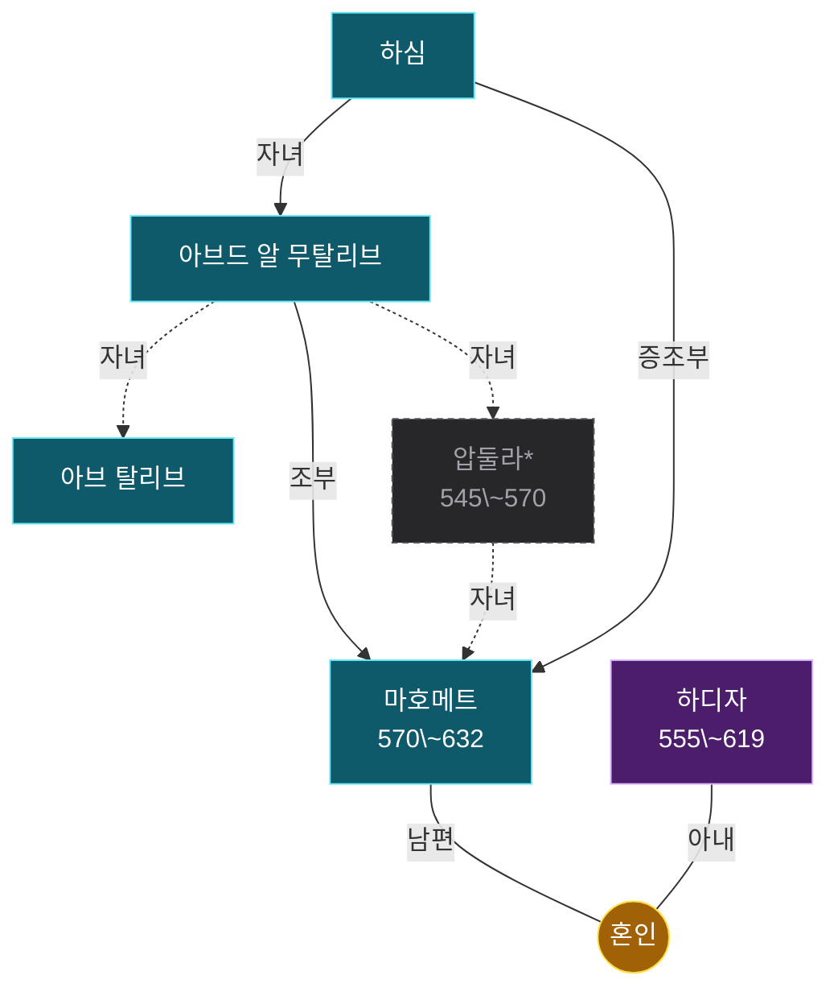

# 족보 하심 계열

인물 6명. 온톨로지의 혈연·혼인·계승 관계에서 생성했다 — 손으로 그린 그림이 아니라 데이터의 파생물이라, 관계를 고치고 `rome30_family.py`를 다시 돌리면 이 그림도 따라 바뀐다.

노란 동그라미가 혼인이고, 자녀는 거기서 내려온다. 상자는 그 혼인에서 난 형제다. 모든 선에 관계를 적었다 — 남편·아내·자녀, 그리고 양자·조부처럼 혈연이 아닌 계보. **점선과 흐린 칸은 이 책 본문에 없는 맥락 보강**이다. 조부·숙부가 빠지면 계보가 끊겨 보여서 외부 지식으로 보탰고, 이름 뒤 별표는 볼트에 노트가 없는 인물이다. 굵은 선은 제위 계승으로 혈연과 다른 축이다. 붉은 칸은 재위 기록이 있는 인물이다.

더 정밀한 그림은 같은 이름의 `.canvas` 파일에 있다 — 세대 번호·개인 번호·남녀 배치까지 계보도 표기를 따랐다. 표기 규칙은 [[족보_표기_설계]]에 있다.

> [!note]- 가까운 친족
>
> 그림에서 선을 따라 세면 나오는 것을 표로 옮겼다. 혈연 간선만 타므로 양자·조부처럼 대를 건너뛴 계보는 여기 들어가지 않는다. 호칭은 보는 사람의 성별과 상대의 나이에 따라 달라진다 — 같은 사람이 누구에게는 백부, 누구에게는 숙부다.
>
> | 사람 | 관계 |
> |---|---|
> | [[마호메트]] | **아버지** 압둘라\* · **조부** [[아브드 알 무탈리브]] · **증조부** [[하심]] · **삼촌** [[아브 탈리브]] · **배우자** [[하디자]] |
> | 압둘라\* | **아버지** [[아브드 알 무탈리브]] · **조부** [[하심]] · **형제** [[아브 탈리브]] · **아들** [[마호메트]] |
> | [[아브 탈리브]] | **아버지** [[아브드 알 무탈리브]] · **조부** [[하심]] · **형제** 압둘라\* |
> | [[아브드 알 무탈리브]] | **아버지** [[하심]] · **아들** 압둘라\*, [[아브 탈리브]] · **손자** [[마호메트]] |
> | [[하심]] | **아들** [[아브드 알 무탈리브]] · **손자** [[아브 탈리브]], 압둘라\* |
> | [[하디자]] | **배우자** [[마호메트]] |

### 인물

- [[마호메트]] — 하심가 출신의 아랍 인물로 40세에 알라의 계시를 받았고 이슬람교를 창시하여 중동 부족들을 단결시켰다.
- [[아브 탈리브]] — 마호메트를 보살펴주고 키운 친척 중 가장 세력가였던 백부.
- [[아브드 알 무탈리브]] — 메카가 예멘 왕국의 병사들에게 포위되었을 때 신의 보호를 믿고 신전을 지킨 마호메트의 조부.
- [[하디자]] — 메카의 귀부인으로 마호메트가 25세 때 일하던 곳에서 그를 채용한 후 결혼한 여성.
- [[하심]] — 메카에 기근이 닥쳤을 때 재산을 분배하여 시민들을 구제한 마호메트의 증조부.
- 압둘라\* — 마호메트의 아버지. 마호메트가 태어나기 전에 죽었다 (본문 밖 보강)
